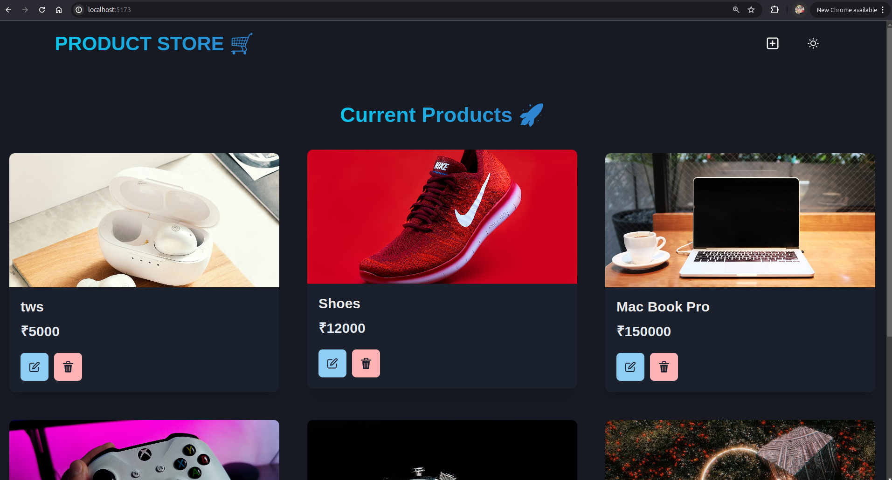

# Product Store

### Deployed site.


## Development and Build Tools

- **Vite** for frontend development and building
- **ESLint** for code quality
- **PostCSS** with Tailwind CSS for styling
- **npm** for package management

### Setup .env file

```bash
PORT=5000
MONGO_URI=your_mongo_uri
NODE_ENV=development
```

### Run this app locally

```shell
npm run build
```

### Start the app

```shell
npm run start
```

### PAIN 
